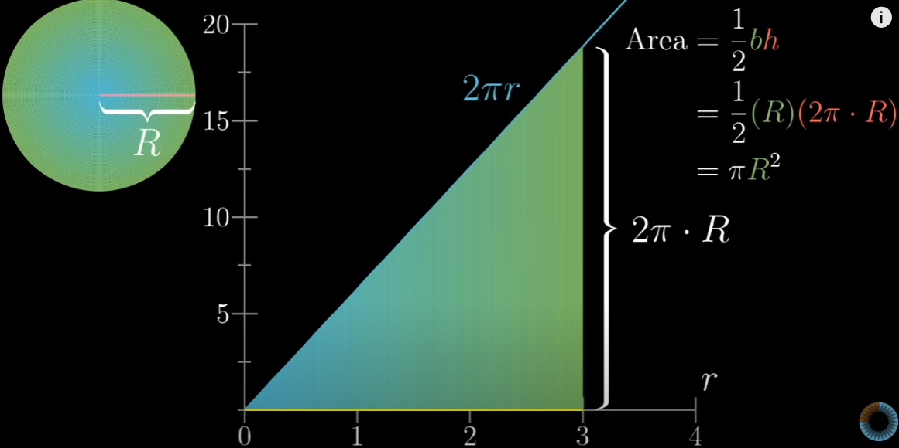
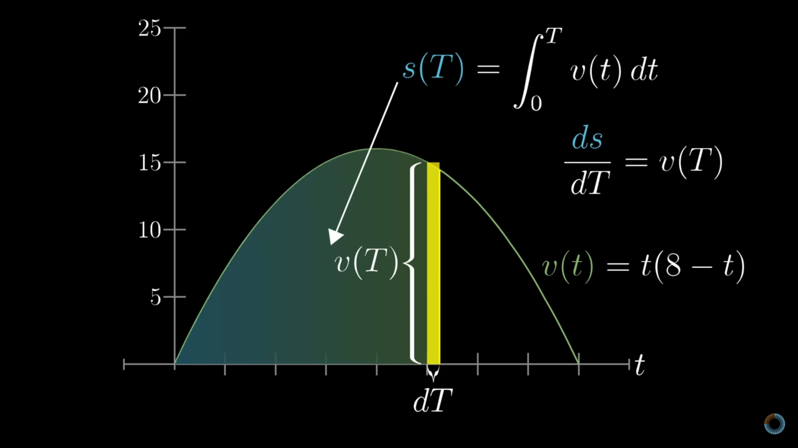

# Learning_ML

------------------

# Resources

| Resources | Completion Status |
|----------|-------------------|
| Essence of Linear Algebra @3Blue1Brown | ✅ |
| Machine Learning Playlist @CampusX | ✅ |
| Hands-On Machine Learning with Scikit-Learn and TensorFlow |⏳|
| Intro to Deep Learning @MIT |⏳|
| Deep Learning Playlist @CampusX |⏳|
| Neural Networks @3Blue1Brown |⏳|
| Deep Learning for Coders with fastai & PyTorch @Oreilly |⏳|

## Progress

| Days  | Topics                                                                 | Resources |
|------:|------------------------------------------------------------------------|-----------|
| [Day00](Day00)   |Learning Python Libraries                   | [w3Schools](https://www.w3schools.com/python/default.asp), [Dursikshya](https://dursikshya.edu.np/) |
| [Day01](Day01)   | Basics of Linear Algebra                                              | [3blue1brown](https://www.youtube.com/@3blue1brown) |
| [Day02](Day02)   | Decomposition, Derivation, Integration, and Gradient Descent           | [3blue1brown](https://www.youtube.com/@3blue1brown) |
| [Day03](Day03)   | Supervised Learning, Regression and classification    definition             | [CampusX](https://www.youtube.com/watch?v=81ymPYEtFOw&t=498s)|
| [Day04](Day04)   | Univariate Linear Regression        | [Campusx](), [Dursikshya](https://dursikshya.edu.np/)|
| [Day05](Day05)   | Bivariate and multivariate Linear Regression                          | [Dursikshya](https://dursikshya.edu.np/),[Campusx](https://www.youtube.com/watch?v=6D3VtEfCw7w&list=PLKnIA16_Rmvbr7zKYQuBfsVkjoLcJgxHH&index=21)|
| [Day06](Day06)   | Standarization -Feature_Scaling                                                     |[Dursikshya](https://dursikshya.edu.np/),[Campusx](https://www.youtube.com/watch?v=1Yw9sC0PNwY&list=PLKnIA16_Rmvbr7zKYQuBfsVkjoLcJgxHH&index=24)|
| [Day07](Day07)   |  Normalization-min_max_scaling                                                    | [CampusX](https://www.youtube.com/@campusx-official), [Dursikshya](https://dursikshya.edu.np/) |
| [Day08](Day08)   | Regression-matrix                                             | [CampusX](https://www.youtube.com/@campusx-official), [Dursikshya](https://dursikshya.edu.np/)|
| [Day09](Day09)   | Ordinal-Encoding                                              | [Campusx](https://www.youtube.com/watch?v=w2GglmYHfmM&list=PLKnIA16_Rmvbr7zKYQuBfsVkjoLcJgxHH&index=26), [Dursikshya](https://dursikshya.edu.np/)|
| [Day10](Day10)   | One_Hot-Encoding                  | [w3Schools](https://www.w3schools.com/python/default.asp),[Campusx](https://www.youtube.com/watch?v=U5oCv3JKWKA&list=PLKnIA16_Rmvbr7zKYQuBfsVkjoLcJgxHH&index=27)|
| [Day11](Day11)   | column-transformer                   | [w3Schools](https://www.w3schools.com/python/default.asp),[Campusx](https://www.youtube.com/watch?v=5TVj6iEBR4I&list=PLKnIA16_Rmvbr7zKYQuBfsVkjoLcJgxHH&index=28) |
| [Day12](Day12)   | predict using with/without pipeline-demo                   | [w3Schools](https://www.w3schools.com/python/default.asp),[Campusx](https://www.youtube.com/watch?v=xOccYkgRV4Q&list=PLKnIA16_Rmvbr7zKYQuBfsVkjoLcJgxHH&index=29) |
| [Day13](Day13)   | function-transformer              | [w3Schools](https://www.w3schools.com/python/default.asp),[Campusx](https://www.youtube.com/watch?v=cTjj3LE8E90&list=PLKnIA16_Rmvbr7zKYQuBfsVkjoLcJgxHH&index=30) |
| [Day14](Day14)   | automatically-select-imputer parameters         | [w3Schools](https://www.w3schools.com/python/default.asp) ,[Campusx](https://www.youtube.com/watch?v=mCL2xLBDw8M&list=PLKnIA16_Rmvbr7zKYQuBfsVkjoLcJgxHH&index=36)|
| [Day15](Day15)   | missing indicator /random-sample-imputation                   | [w3Schools](https://www.w3schools.com/python/default.asp),[Campusx](https://www.youtube.com/watch?v=Ratcir3p03w&list=PLKnIA16_Rmvbr7zKYQuBfsVkjoLcJgxHH&index=38) |
| [Day16](Day16)   | mean-median- imputation                   | [w3Schools](https://www.w3schools.com/python/default.asp) ,[Campusx](https://www.youtube.com/watch?v=l_Wip8bEDFQ&list=PLKnIA16_Rmvbr7zKYQuBfsVkjoLcJgxHH&index=37)|
| [Day17](Day17)   | frequent-value-imputation/missing-category-imputation                    | [w3Schools](https://www.w3schools.com/python/default.asp),[Campusx](https://www.youtube.com/watch?v=Ratcir3p03w&list=PLKnIA16_Rmvbr7zKYQuBfsVkjoLcJgxHH&index=38) |
| [Day18](Day18)   |   knn-handling missing data                 | [w3Schools](https://www.w3schools.com/python/default.asp),[Campusx](https://www.youtube.com/watch?v=-fK-xEev2I8&list=PLKnIA16_Rmvbr7zKYQuBfsVkjoLcJgxHH&index=39) |
| [Day19](Day19)   | outlier-detection               | [w3Schools](https://www.w3schools.com/python/default.asp), [Dursikshya](https://dursikshya.edu.np/),[Campusx](https://www.youtube.com/watch?v=Lln1PKgGr_M&list=PLKnIA16_Rmvbr7zKYQuBfsVkjoLcJgxHH&index=41) |
| [Day20](Day20)   | Feature construction-splitting              | [w3Schools](https://www.w3schools.com/python/default.asp) , [Dursikshya](https://dursikshya.edu.np/),[Campusx](https://www.youtube.com/watch?v=ma-h30PoFms&list=PLKnIA16_Rmvbr7zKYQuBfsVkjoLcJgxHH&index=45)|
| [Day21](Day21)   | pca (principle component analysis)                   | [w3Schools](https://www.w3schools.com/python/default.asp), [Dursikshya](https://dursikshya.edu.np/),[Campusx](https://www.youtube.com/watch?v=iRbsBi5W0-c&list=PLKnIA16_Rmvbr7zKYQuBfsVkjoLcJgxHH&index=47) |
| [Day22](Day22)   | web scraping demo  |  [Campusx](https://www.youtube.com/watch?v=8NOdgjC1988&list=PLKnIA16_Rmvbr7zKYQuBfsVkjoLcJgxHH&index=18)|
| [Day23](Day23)   | Linear regression (m,b)                             | [Dursikshya](https://dursikshya.edu.np/),[Campusx](https://www.youtube.com/watch?v=UZPfbG0jNec&list=PLKnIA16_Rmvbr7zKYQuBfsVkjoLcJgxHH&index=50)|
| [Day24](Day24)   | multiple linear Regression -simple                  | [w3Schools](https://www.w3schools.com/python/default.asp), [Dursikshya](https://dursikshya.edu.np/),[Campusx]() |
| [Day25](Day25)   | multiple linear Regression from scratch                  | [w3Schools](https://www.w3schools.com/python/default.asp), [Dursikshya](https://dursikshya.edu.np/),[Campusx](https://www.youtube.com/watch?v=ashGekqstl8&list=PLKnIA16_Rmvbr7zKYQuBfsVkjoLcJgxHH&index=53) |
| [Day26-29](Day26)   | gradient discent from scratch (simple,m,b,2D,3D)                 | [w3Schools](https://www.w3schools.com/python/default.asp), [Dursikshya](https://dursikshya.edu.np/) ,[Campusx](https://www.youtube.com/watch?v=ORyfPJypKuU&list=PLKnIA16_Rmvbr7zKYQuBfsVkjoLcJgxHH&index=56)|
| [Day30](Day30)   | Batch - GD                  | [w3Schools](https://www.w3schools.com/python/default.asp),[Campusx](https://www.youtube.com/watch?v=Jyo53pAyVAM&list=PLKnIA16_Rmvbr7zKYQuBfsVkjoLcJgxHH&index=57) |
| [Day31](Day31)   | stochastic gradient descent                    | [w3Schools](https://www.w3schools.com/python/default.asp),[Campusx](https://www.youtube.com/watch?v=V7KBAa_gh4c&list=PLKnIA16_Rmvbr7zKYQuBfsVkjoLcJgxHH&index=58) |
| [Day32](Day32)   | stochastic gradient descent animation                  | [w3Schools](https://www.w3schools.com/python/default.asp),[Campusx](https://www.youtube.com/watch?v=V7KBAa_gh4c&list=PLKnIA16_Rmvbr7zKYQuBfsVkjoLcJgxHH&index=58) |
| [Day33](Day33)   | mini batch gradient descent                 | [w3Schools](https://www.w3schools.com/python/default.asp),[Campusx](https://www.youtube.com/watch?v=_scscQ4HVTY&list=PLKnIA16_Rmvbr7zKYQuBfsVkjoLcJgxHH&index=59) |
| [Day34](Day34)   | polynomial regression                  | [w3Schools](https://www.w3schools.com/python/default.asp),[Campusx]() |
| [Day35](Day35)   | cross validation                   | [w3Schools](https://www.w3schools.com/python/default.asp),[Campusx]() |
| [Day36](Day36)   | logistic regression                    | [w3Schools](https://www.w3schools.com/python/default.asp),[Campusx]() |
| [Day37](Day37)   | decision tree                    | [w3Schools](https://www.w3schools.com/python/default.asp),[Campusx]() |
| [Day38](Day38)   | Random Forest                   | [w3Schools](https://www.w3schools.com/python/default.asp),[Campusx]() |
| [Day39](Day39)   | Polynomial and Multiple Regression                   | [w3Schools](https://www.w3schools.com/python/default.asp),[Campusx]() |
| [Day40](Day40)   | Logistic Regression using Scratch                  | [w3Schools](https://www.w3schools.com/python/default.asp),[Campusx]() |
| [Day41](Day41)   | Ridge Regression                   | [w3Schools](https://www.w3schools.com/python/default.asp),[Campusx]() |
| [Day42](Day42)   | Lasso Regression                 | [w3Schools](https://www.w3schools.com/python/default.asp),[Campusx]() |
| [Day43](Day40)   | ElasticNet Regression                   | [w3Schools](https://www.w3schools.com/python/default.asp),[Campusx]() |
| [Day44](Day40)   |Learning Python Libraries                   | [w3Schools](https://www.w3schools.com/python/default.asp),[Campusx]() |

-------------------------------------
## Day 00: Python Libraries
- Numpy
- Pandas
- Matplotlib
- str_Method
--------------------------------------

# Day 01: Basics of Linear Algebra

linear algebra is used to represent data, perform matrix operations, and solve equations in algorithms like regression, pca, and neural networks.

- Scalars, Vectors, Matrices, Tensors: Basic data structures for ML.

- Linear Combination and Span: Representing data points as weighted sums. Used in Linear Regression and neural networks.

- Determinants: Matrix invertibility, unique solutions in linear regression.
- Dot and Cross Product: Similarity (e.g., in SVMs) and vector transformations.

Slow progress right?? but consistent wins the race!
-----------------------------------------------------

# Day 02:Decomposition, Derivation, Integration, and Gradient Descent
--------------------------------------
- Identity and Inverse Matrices: Solving equations (e.g., linear regression) and optimization (e.g., gradient descent).

- Eigenvalues and Eigenvectors: PCA, SVD, feature extraction; eigenvalues capture variance.

Notes Here

## Calculus Overview:
- Functions & Graphs: Relationship between input (e.g., house size) and output (e.g., house price).

- Derivatives: Adjust model parameters to minimize error in predictions (e.g., house price). 

- Partial Derivatives: Measure change with respect to one variable, used in neural networks for weight updates.

- Gradient Descent: Optimization to minimize the cost function (error).

- Optimization: Finding the best values (minima/maxima) of a function to improve predictions.

- Integrals: Calculate area under a curve, used in probabilistic models (e.g., Naive Bayes).
 

Revised statistics and probability concepts. Ready for the ML Specialization course!
---------------------------------------------------------------------

# Day 03: Supervised Learning: Regression and Classification

- Supervised Learning:

- Classification and Regression:

------------------------------------------------------------------------\

==========================================================================

